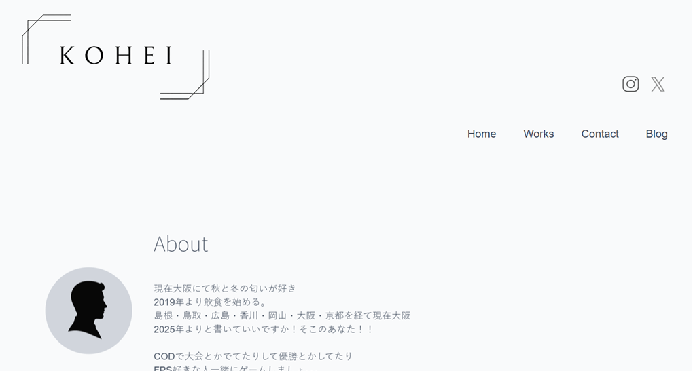
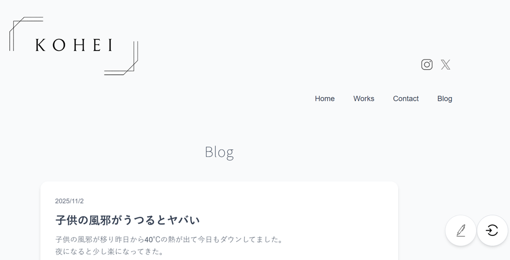

# 📝 my-blog

> **エンジニアとしての学びを形に残すための個人ポートフォリオサイト**



## 🚀 サービス概要

**my-blog** は、Next.js × Supabase × Prisma を使用して構築した個人ポートフォリオサイトです。

自己紹介、ブログ記事の投稿・管理、お問い合わせフォームなどを備えた、シンプルで実用的なポートフォリオアプリケーションとして設計しています。

## 💭 このサービスへの思い・作りたい理由

> 「エンジニアとしての学びを形に残すため」「自分の技術成長を可視化したい」

学んだ内容を頭の中だけで終わらせず、  
「書くこと」で理解を深めるためにこのブログを作成しました。  
SNSのような発信ではなく、**自分のための記録**として続けていける場所を目指しています。

## ✨ サービスの差別化ポイント

他の技術ブログ（Zenn、Qiitaなど）と違い、  
**完成した記事**ではなく「**学びの過程**」をそのまま残すことにフォーカスしています。

- 失敗や試行錯誤もそのまま残せる
- 書くことで学習の定着を促す
- 技術スタックの練習・アウトプットの場として使える

## 🧩 機能一覧

| 機能名 | 概要 | 状況 |
|:--|:--|:--|
| ホームページ | プロフィール・自己紹介の表示 | ✅ 実装済み |
| ブログ一覧表示 | 投稿された記事をカード形式で一覧表示 | ✅ 実装済み |
| 記事詳細ページ | 記事内容を1ページで表示 | ✅ 実装済み |
| 新規投稿 | タイトル・本文を入力して投稿 | ✅ 実装済み |
| 編集・削除 | 投稿済みの記事を編集／削除 | ✅ 実装済み |
| 画像添付 | Supabase Storage を利用した画像アップロード | ✅ 実装済み |
| 認証（管理者のみ投稿可） | Supabase Authでログイン制限 | ✅ 実装済み |
| お問い合わせフォーム | 連絡先情報とメッセージ送信フォーム | 🔜 拡充予定 |
| Worksページ | 今後の作品一覧表示用 | 🔜 拡充予定 |

## ⚙️ 機能の実装方針

- **Next.js 15（App Router）** を採用し、クライアント／サーバーを統合的に管理
- **Supabase** を BaaS（Backend as a Service）として利用し、PostgreSQL＋認証を一元化
- **Prisma** を ORM として使用し、スキーマ管理と型安全なデータ操作を実現
- **Tailwind CSS** による統一されたUIデザインとレスポンシブ対応
- **Framer Motion** を活用したスムーズなページ遷移アニメーション

## 🧠 ブログ投稿機能の仕組み



1. ユーザーが投稿フォームで「タイトル」「内容」を入力
2. `/api/blog` へ **POSTリクエスト** が送信される
3. APIルート ([src/app/api/blog/route.ts](src/app/api/blog/route.ts)) 内で **Prisma** がデータベースに新規登録
4. 登録完了後、**再フェッチ**で画面に反映される

## 🧱 技術スタック

| カテゴリ | 使用技術 |
|:--|:--|
| フレームワーク | Next.js 15 (App Router) |
| 言語 | TypeScript |
| スタイリング | Tailwind CSS v4 |
| データベース | Supabase (PostgreSQL) |
| ORM | Prisma |
| アニメーション | Framer Motion (motion) |
| デプロイ | Vercel |
| 認証／Storage | Supabase Auth / Storage |

## 🌐 デプロイ先

**Vercel**  
https://my-blog-lyart-eight-42.vercel.app/

## 📁 ディレクトリ構成

my-blog/ ├── src/ │ ├── app/ │ │ ├── api/ │ │ │ ├── auth/ │ │ │ │ └── route.ts # 認証API │ │ │ └── blog/ │ │ │ ├── route.ts # ブログCRUD API │ │ │ └── [id]/ │ │ │ └── route.ts # 個別記事のAPI │ │ ├── components/ │ │ │ ├── header.tsx # ヘッダーコンポーネント │ │ │ ├── fotter.tsx # フッターコンポーネント │ │ │ └── LogoutButton.tsx # ログアウトボタン │ │ ├── Home/ │ │ │ └── page.tsx # ホーム（プロフィール）ページ │ │ ├── Blog/ │ │ │ └── page.tsx # ブログ一覧ページ │ │ ├── Contact/ │ │ │ └── page.tsx # お問い合わせページ │ │ ├── Works/ │ │ │ └── page.tsx # 作品一覧ページ │ │ ├── login/ │ │ │ └── page.tsx # ログインページ │ │ ├── layout.tsx # ルートレイアウト │ │ ├── template.tsx # ページテンプレート │ │ ├── page.tsx # エントリーポイント │ │ └── globals.css # グローバルスタイル │ ├── lib/ │ │ ├── prisma.ts # Prismaクライアント設定 │ │ └── supabase.ts # Supabaseクライアント設定 │ └── types.ts # TypeScript型定義 ├── prisma/ │ ├── schema.prisma # Prismaスキーマ定義 │ └── migrations/ # データベースマイグレーション ├── public/ # 静的ファイル（画像など） ├── .env.local # 環境変数（非公開） ├── package.json ├── tailwind.config.ts ├── next.config.ts └── tsconfig.json


## 🚀 セットアップ方法

### 1. リポジトリのクローン

```bash
git clone <repository-url>
cd my-blog
2. 依存関係のインストール

npm install
3. 環境変数の設定
.env.local ファイルを作成し、以下の環境変数を設定してください：

# Supabase
NEXT_PUBLIC_SUPABASE_URL=your-supabase-url
NEXT_PUBLIC_SUPABASE_ANON_KEY=your-supabase-anon-key

# Prisma (Supabase Connection Pooler)
DATABASE_URL=your-database-url
DIRECT_URL=your-direct-url
4. データベースのマイグレーション

npx prisma migrate dev
5. 開発サーバーの起動

npm run dev
ブラウザで http://localhost:3000 を開いてください。
💡 今後の展望
マークダウンエディタの導入
タグ機能・検索機能
管理者専用ダッシュボード
SNS連携（X共有ボタンなど）
Worksページの拡充（ポートフォリオ作品の追加）
お問い合わせフォームのバックエンド実装
📄 ライセンス
このプロジェクトは個人のポートフォリオサイトとして作成されています